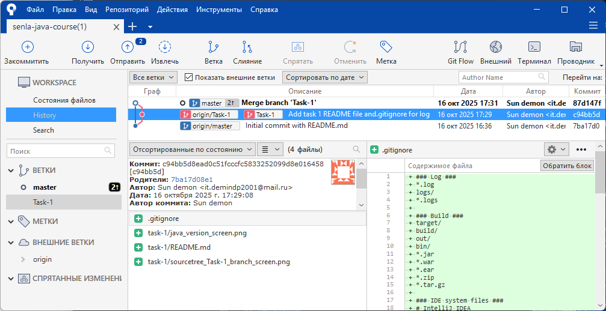

# Задание 1

Инструменты контроля версий. GIT

## Описание

1. Установить JDK 17
2. Установить SourceTree
3. От ветки `Task-1` добавить `.gitignore` для логов, файлов IDE, документации и других специфических данных.

## Результат

1. `java --version`

2. Окно SourceTree с `Task-1` веткой

3. Ссылка на [`.gitignore`](../.gitignore)

## Изменения

От `16.10.2025`: 

- Сброшена ветка `master`
- Удалена ветка `task1`

которые ранее (`07.10.2025`) были объединены.

Это было сделано связи с:

- С домашнего задания №2 был стандартизирован формат именования веток как `Task-N`, где вместо `N` - номер задания
- Аналогично добавилось требование аккумулирования информации о выполнении задания в директория `task-N`, где вместо `N` - номер задания
