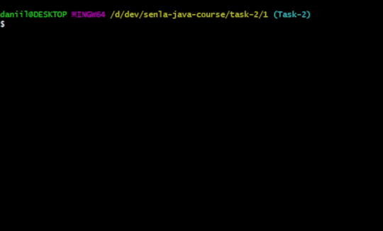

# 📝 Подзадание 1
Написать первую программу типа "Hello world" на Java без использования IDE. Программа состоит из одного класса `Greeting` с методом `main()`.

## 📋 Описание подзадания
Написать первую программу типа "Hello world" на Java. Программа должна состоять из одного класса с именем `Greeting`. Класс должен содержать один метод `public static main()`. Разработку класса выполнять в любом текстовом блокноте. Компиляцию проводить при помощи `javac`. 

## Требования к выполнению:
- Исходный `.java` файл и откомпилированный  `.class` файл должны быть "вкомитаны" в GIT;
- Использование для выполнения любых IDE не допускается;
- Для вывода сообщения использовать - `System.out.println("Hello Java!")`

## 🎬🚀 Демонстрация процесса выполнения

## 🛠 Используемые инструменты
- **Терминал**: Mintty (Git Bash)
- **Компилятор**: javac
- **Виртуальная машина**: java
- **Текстовый редактор**: VS Code (для README.md)
- **Другое**: OBS Studio и ShotCut (для GIF)
