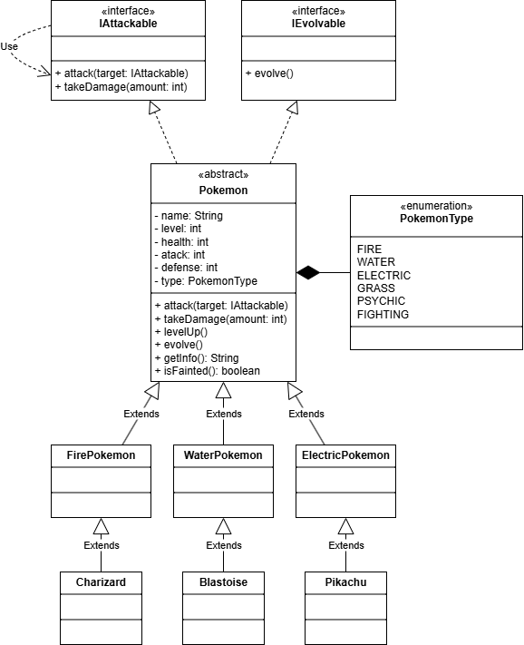

# 🧩 Подзадание 2

Найти и установить удобную для вас программу для рисования диаграмм классов (как вариант может быть использована бесплатная версия Visual Paradigm от Agilian - http://www.visual-paradigm.com/download/vpuml.jsp?edition=ce или онлайн сервис https://www.draw.io/).

## ⚙️ Инструмент

Для выполнения работы была выбрана программа [draw.io](https://www.drawio.com)

Она позволяет как выполнять работу по созданию диаграм как в [онлайн](https://app.diagrams.net) с сохранением информации в облачные сервисы или локально, так и в [оффлайн](https://get.diagrams.net/) после загрузки программы 

## 🔥💧⚡ Выполненная работа

В рамках задания была создана UML-диаграмма классов для системы, моделирующей мир Pokemon.

Интерфейсы:

- `IAttackable` — описывает возможность атаки и получения урона.
- `IEvolvable` — определяет возможность эволюции покемона.

Абстрактный класс Pokemon:

- содержит общие поля (имя, уровень, здоровье, тип, силу атаки и т.д.);
- реализует интерфейсы `IAttackable` и `IEvolvable`.

Подклассы по типам: `FirePokemon`, `WaterPokemon`, `ElectricPokemon`.

Конкретные виды: `Charizard`, `Blastoise`, `Pikachu`.

Перечисление `PokemonType`: определяет типы покемонов (`FIRE`, `WATER`, `ELECTRIC` и др.).

## 🪄 Пример UML диаграммы классов
