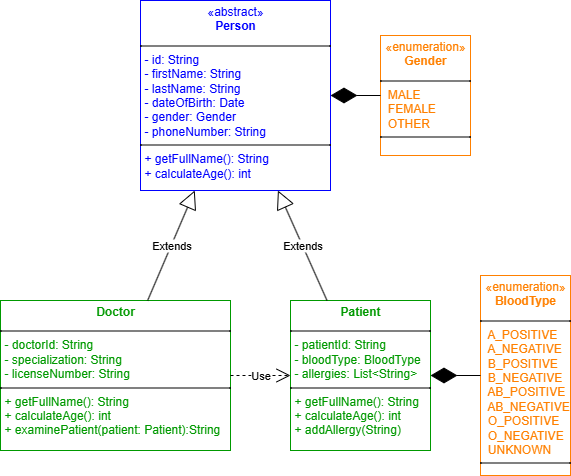
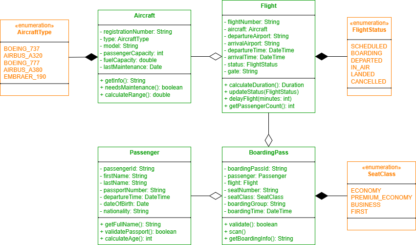

# Подзадание 3 

Диаграммы классов

## Описание
Составить детализированную диаграмму классов для сущности, которая будет использована в гипотетической программе (2 на выбор):

1. Сотрудник – сущность будет использована в программе для отдела кадров;
2. [Пациент — сущность будет использована в медицинской программе для поликлиник](#patient);
3. [Самолет — сущность будет использована в программе контроля полетов для диспетчерской аэропорта](#airplane);
4. Клиент – сущность будет использована в банковской системе работы с клиентами;
5. Резюме – сущность будет использована в программе для онлайн поиска работы.

## Требования к выполнению:

1. Не менее 4 классов;
2. Диаграмма содержит иерархии и связи;
3. Все классы должны иметь свойства и методы;
4. Исходные файлы диаграмм (в формате выбранного вами редактора) должен быть влиты в GIT;
5. Диаграммы должны быть также сохранены в графический файл и влиты в GIT;
6. Текст на диаграммах должен легко читаться.

## Реализация UML диаграмм классов

### 2. 🤕 Пациент 

Медицинская система для поликлиник

### 3. ✈️ Самолёт 

Авиационная система дли диспетчерской

