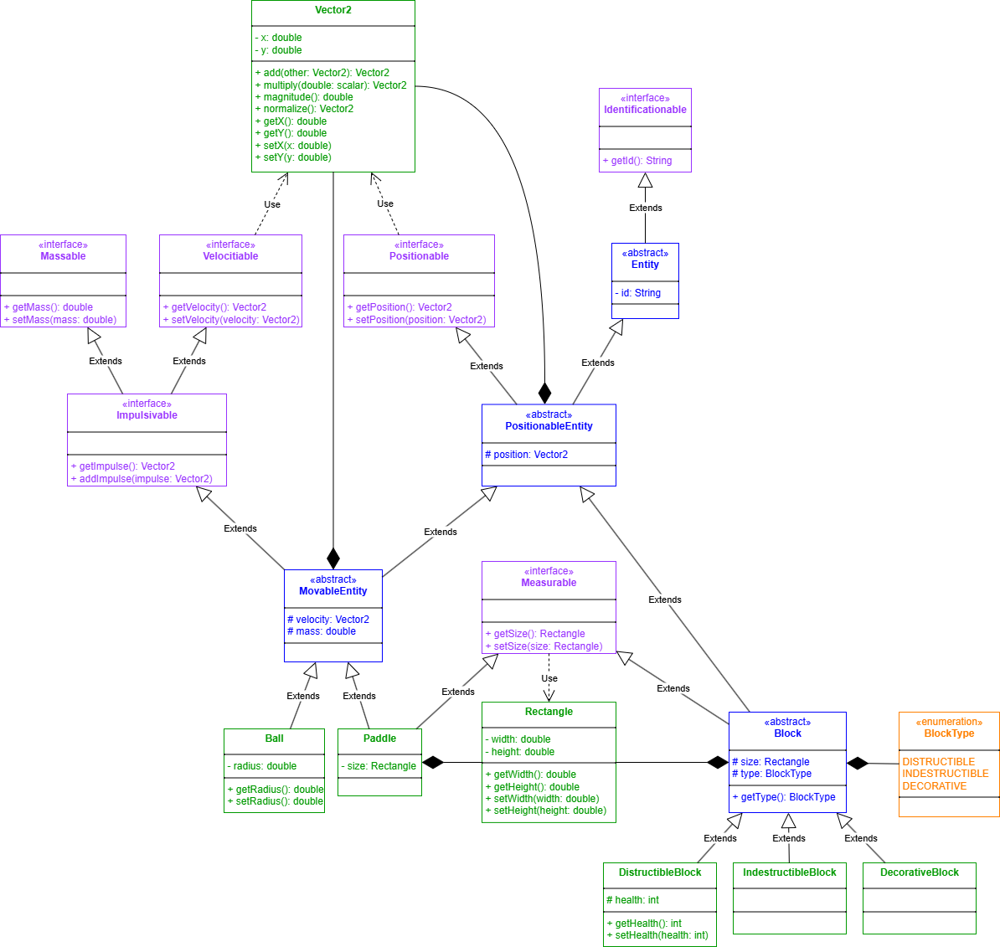

# Подзадание 4

Диаграммы классов игры

## Описание

Составить детализированную диаграмму классов для простой программы-игры (на выбор):

1. Lines;
2. Тетрис;
3. Сапер;
4. Пасьянс;
5. [Арканоид](#arkanoid).

## Требования к выполнению:

1. Диаграмма должна покрывать максимальное количество аспектов реализации игры;
2. Не менее 15 классов (должны встречаться интерфейсы и абстрактные классы);
3. Соблюдать принцип сильного сцепления;
4. Диаграмма содержит иерархии;
5. Все классы должны иметь свойства и методы;
6. Диаграмма содержит агрегации и композиции;
7. Исходный файл диаграмм (в формате выбранного вами редактора) должен быть влит в GIT;
8. Диаграммы должны быть также сохранены в графический файл и влиты в GIT;
9. Текст на диаграммах должен легко читаться.

## Реализация UML диаграмм классов игры "Арканоид" 

