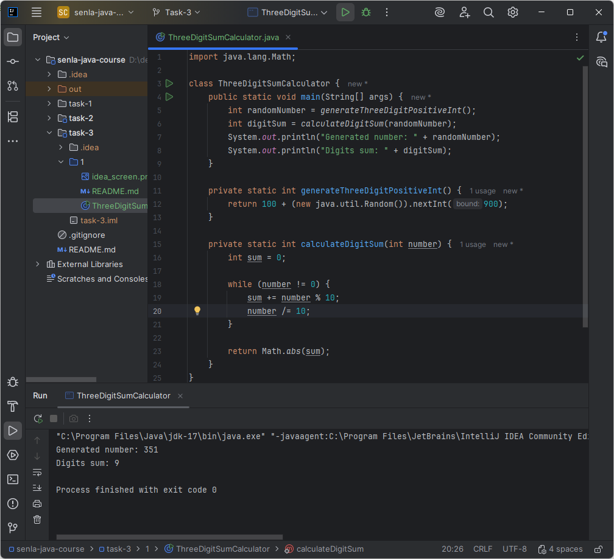

# Подзадание 1
Написать первую программу генерации и обработки трёхзначного числа на Java с использованием IntellijIDEA Community.

## Описание
Написать на выбор одну из 4-ёх программ (выбран [вариант 4](#var4)):

1. Выводящую на экран случайно сгенерированное трёхзначное натуральное число и его наибольшую цифру;
2. Выводящую на экран 3 случайно сгенерированных трёхзначных числа и сумму их первых цифр;
3. Выводящую на экран 3 случайно сгенерированных трёхзначных числа и разницу между числом, 
   получившимся методом последовательной записи 1-го и 2-го числа, и 3-ьим числом;
4. [Выводящую на экран случайно сгенерированное трёхзначное натуральное число и сумму его цифр.](ThreeDigitSumCalculator.java)
   <a id="var4"></a>

## Требования
- Исходные .java файлы должны быть «вкомитаны» в GIT в соответствующую ветку
- Использовать для выполнения IDE
- Для вывода сообщения использовать - ```System.out.println();```
- Для генерации случайных целых чисел использовать следующую конструкцию: ```(new java.util.Random()).nextInt(MAX_NUMBER);```

## Пример работы
```
Generated number: 516
Digits sum: 12
```

## Демонстрация


