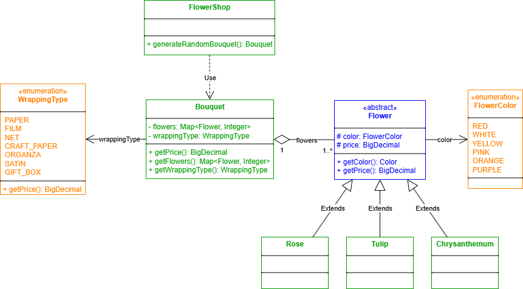
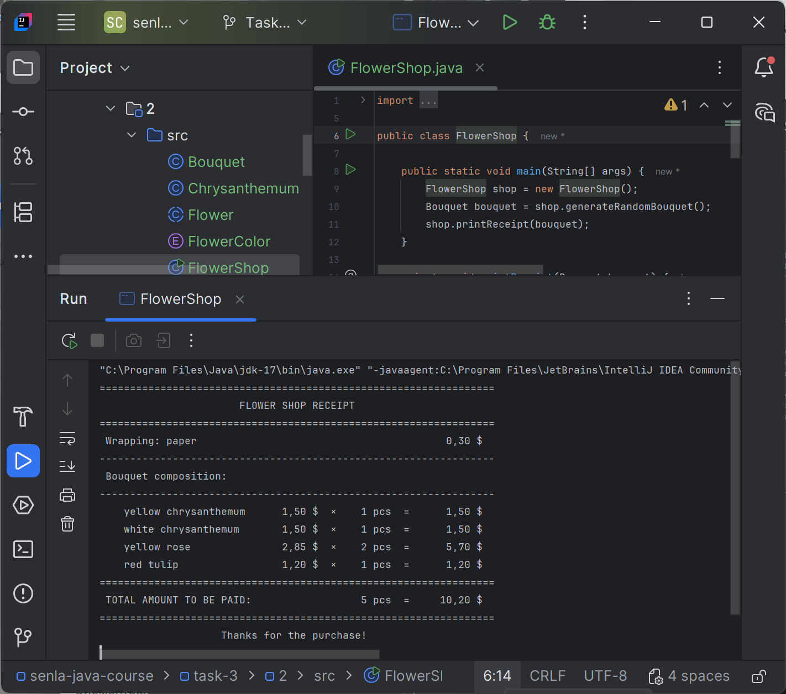

# Подзадание 2
Написать программу, содержащую иерархии классов. 
Аккумулировать объекты этих классов в классе-коллекции.
Определить результирующий параметр заполненной коллекции.


## Описание
Написать программу (только одну из 3-х): (выбран [вариант 1](#uml-диаграмма-классов)):

1. [Содержащую иерархии цветов для цветочного магазина. Собрать букет и определить его стоимость](#uml-диаграмма-классов);
2. Содержащую иерархии товаров для склада. Заполнить склад до предела и высчитать вес хранимого товара;
3. Содержащую иерархию сотрудников фирмы. Укомплектовать фирму по производству программного обеспечения и рассчитать общую месячный оклад сотрудников;

## Требования
- Исходные .java файлы должны быть «вкомитаны» в GIT в соответствующую ветку
- Использовать для выполнения IDE
- Для вывода сообщения использовать - ```System.out.println();```
- Для генерации случайных целых чисел использовать следующую конструкцию: ```(new java.util.Random()).nextInt(MAX_NUMBER);```


## UML-диаграмма классов
UML-диаграмма классов приложения цветочного магазина


## Пример работы
```
=================================================================
                       FLOWER SHOP RECEIPT
=================================================================
 Wrapping: paper                                         0,30 $
-----------------------------------------------------------------
 Bouquet composition:
-----------------------------------------------------------------
    red chrysanthemum         1,65 $  ×    1 pcs  =      1,65 $
    pink chrysanthemum        1,65 $  ×    1 pcs  =      1,65 $
    pink rose                 3,15 $  ×    2 pcs  =      6,30 $
    red tulip                 1,20 $  ×    1 pcs  =      1,20 $
=================================================================
 TOTAL AMOUNT TO BE PAID:                  5 pcs  =     11,10 $
=================================================================
                    Thanks for the purchase!
```

## Демонстрация
