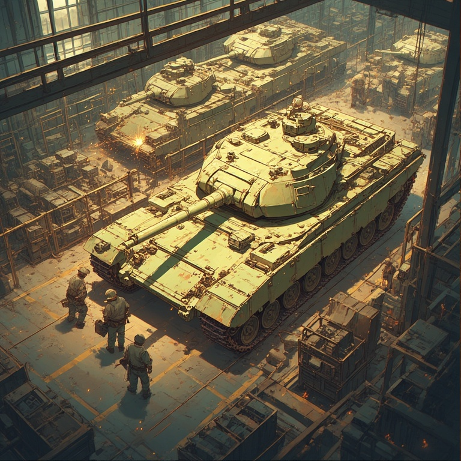
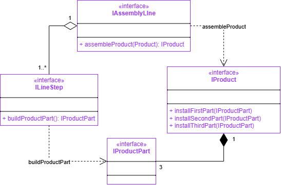
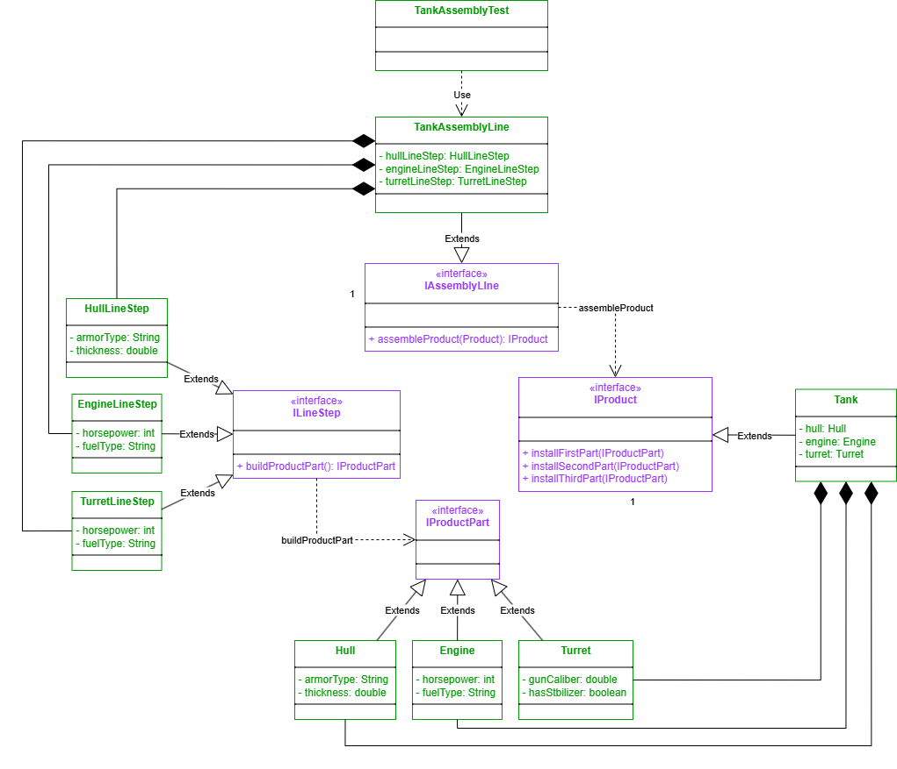
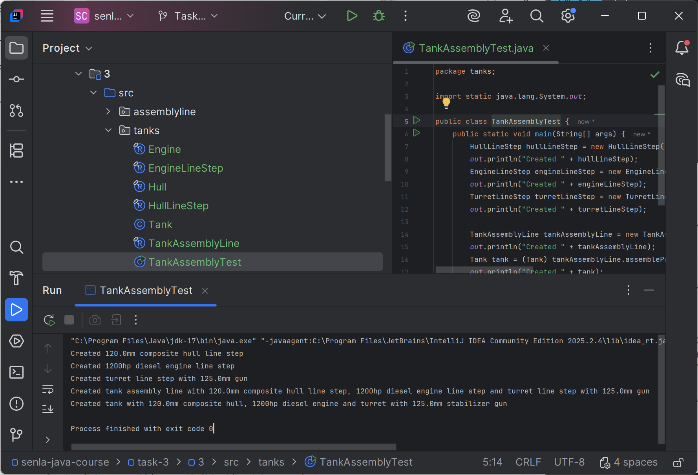

# Подзадание 3
Реализовать сборочную линию объектов.



## Описание
Реализовать сборочную линию объектов, которая реализует интерфейсы, приведенные на следующей диаграмме:


Задача сборочной линии - собирать сложные продукты, состоящие из 3-х составляющих. 
Для установки каждой части должен использоваться специализированный класс (реализующий ```ILineStep```), 
который поставляет необходимую часть через метод ```buildProductPart()```. 
Для сборки продукта его заготовка передается в метод ```assembleProduct()```. 
Внутри этого метода линия получает 3 необходимых составляющих и «устанавливает» их в соответствующие методы полученного продукта. 
После завершения «сборки», готовый продукт возвращается из метода ```assembleProduct()```.

Варианты сборочных линий (выбран [вариант 2](#uml-диаграмма-классов)):

1. Автомобили (кузов, шасси, двигатель)
2. [Танки (корпус, двигатель, башня)](src/tanks/TankAssemblyTest.java)
3. Ноутбуки (корпус, материнская плата, монитор)
4. Автоматические шариковые ручки (корпус, пружина, стержень)
5. Очки (корпус, линзы, дужки)

Реализовать отдельный проверочный класс с методом ```main()```, который сконструирует сборочную линию со всеми ее шагами, и протестирует ее запуском одного продукта на сборку.

Весь процесс сборки должен детально выводиться пользователю на консоль.

## Требования к выполнению

1. В конструктор сборочной линии должны передаваться 3 ссылки на необходимые сборочные шаги
2. Для разработки использовать IDE
3. Для вывода сообщений использовать - ```System.out.println(“ТЕКСТ_СООБЩЕНИЯ”);```

## UML-диаграмма классов
UML-диаграмма классов приложения сборочной линии танков


## Пример работы
```
Created 120.0mm composite hull line step
Created 1200hp diesel engine line step
Created turret line step with 125.0mm gun
Created tank assembly line with 120.0mm composite hull line step, 1200hp diesel engine line step and turret line step with 125.0mm gun
Created tank with 120.0mm composite hull, 1200hp diesel engine and turret with 125.0mm stabilizer gun
```

## Демонстрация
