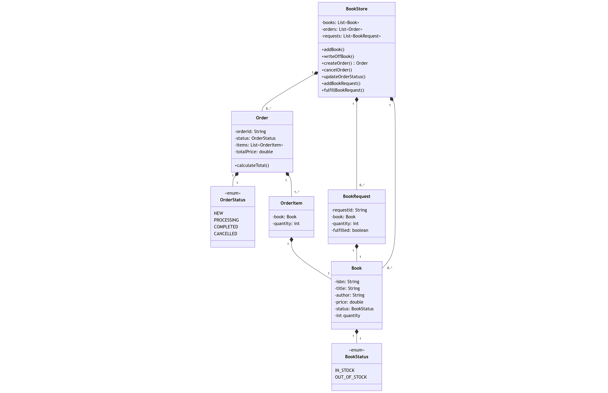

# Подзадание 4
Написать программу электронного сервиса на выбор.


## Описание
Написать программу (только одну из 3-х) (выбран [вариант 2](#2-электронный-книжный-магазин))

Данное задание будет дорабатываться на протяжении всех курсов.

### 1. Электронный администратор гостиницы.
Программа должна предоставлять возможность:
- Поселить в номер; 
- Выселить из номера;
- Изменить статус номера на ремонтируемый/обслуживаемый; 
- Изменить цену номера или услуги; 
- Добавить номер или услугу.

### [2. Электронный книжный магазин.](#uml-диаграмма-классов)
Программа должна предоставлять возможность:
- Списать книгу со склада (перевести в статус “отсутствует”);
- Создать заказ;
- Отменить заказ;
- Изменить статус заказа (новый, выполнен, отменен);
- Добавить книгу на склад (закрывает все запросы книги и меняет ее статус на “в наличии”);
- Оставить запрос на книгу.

<i>Дополнение</i>:
- Все доступные книги заранее определены.<br>
  Они могут быть в статусах “в наличии” или “отсутствует”.<br> 
  Под “Оставить запрос на книгу” подразумевается создание запроса на книгу, что сейчас “отсутствует”.
- При создании заказа с книгой, которой нет в наличии - автоматически создается запрос на эту книгу.<br>
  Заказ не может быть завершен, до тех пор, пока запрос книги не будет выполнен.

### 3. Электронный администратор автосервиса
Программа должна предоставлять возможность:
- Добавить/удалить мастера;
- Добавить/удалить место в гараже;
- Добавить/удалить/закрыть/отменить заказ;
- Сместить время выполнения заказов (из-за задержек в выполнении текущего).

## Требования к подзадаче
1. К программе <b>НЕ реализовывать</b> консольный пользовательский интерфейс.<br> 
   Работоспособность программы проверять из тестового класса с методом main;
2. К программе должна быть создана диаграмма классов;
3. Программа должна соответствовать принципам ООП и паттернам <b>«Сильная связность»</b> и <b>«Слабая связанность»</b>;
4. Для вывода результатов работы использовать ```System.out.println(message)```;
5. Исходные файлы ```.java``` должны быть влиты в GIT в соответствующую ветку.

## UML-диаграмма классов
UML-диаграмма классов электронного книжного магазина


## Результат
```
=== ТЕСТИРОВАНИЕ ЭЛЕКТРОННОГО КНИЖНОГО МАГАЗИНА ===


=== КАТАЛОГ КНИГ ===
'Мастер и Маргарита' - Михаил Булгаков (ISBN: 978-5-699-12014-7) | В наличии | 10 шт. | $15,99
'1984' - Джордж Оруэлл (ISBN: 978-5-17-090823-9) | В наличии | 5 шт. | $12,50
'Преступление и наказание' - Фёдор Достоевский (ISBN: 978-5-389-08243-8) | Отсутствует | 0 шт. | $14,75
'Гарри Поттер и философский камень' - Дж. К. Роулинг (ISBN: 978-5-04-103497-9) | В наличии | 8 шт. | $18,99
'Война и мир' - Лев Толстой (ISBN: 978-5-17-100389-7) | В наличии | 3 шт. | $22,25

--- СОЗДАНИЕ ЗАКАЗА ---
Создан новый заказ #2319fa8d
Добавлена в заказ: Мастер и Маргарита × 2 = $31,98
Создан запрос на книгу: Запрос #dae2fc01: Преступление и наказание × 1 шт. | Ожидание
Книга 'Преступление и наказание' отсутствует. Создан запрос.
Добавлена в заказ: Преступление и наказание × 1 = $14,75

=== ОЖИДАЮЩИЕ ЗАПРОСЫ ===
Запрос #dae2fc01: Преступление и наказание × 1 шт. | Ожидание

--- ПОСТУПЛЕНИЕ КНИГ НА СКЛАД ---
Добавлены книги: Преступление и наказание (+5 шт.)
Выполнен запрос #dae2fc01 на книгу: Преступление и наказание

=== КАТАЛОГ КНИГ ===
'Мастер и Маргарита' - Михаил Булгаков (ISBN: 978-5-699-12014-7) | В наличии | 10 шт. | $15,99
'1984' - Джордж Оруэлл (ISBN: 978-5-17-090823-9) | В наличии | 5 шт. | $12,50
'Преступление и наказание' - Фёдор Достоевский (ISBN: 978-5-389-08243-8) | В наличии | 5 шт. | $14,75
'Гарри Поттер и философский камень' - Дж. К. Роулинг (ISBN: 978-5-04-103497-9) | В наличии | 8 шт. | $18,99
'Война и мир' - Лев Толстой (ISBN: 978-5-17-100389-7) | В наличии | 3 шт. | $22,25

=== ОЖИДАЮЩИЕ ЗАПРОСЫ ===

--- ВТОРОЙ ЗАКАЗ ---
Создан новый заказ #b3e044b7
Добавлена в заказ: 1984 × 1 = $12,50
Добавлена в заказ: Война и мир × 2 = $44,50

--- ИЗМЕНЕНИЕ СТАТУСА ЗАКАЗА ---
Статус заказа #b3e044b7 изменен на: Выполнен

--- СПИСАНИЕ КНИГ ---
Списаны книги: Мастер и Маргарита (-1 шт.)

=== ИТОГОВОЕ СОСТОЯНИЕ ===

=== КАТАЛОГ КНИГ ===
'Мастер и Маргарита' - Михаил Булгаков (ISBN: 978-5-699-12014-7) | В наличии | 9 шт. | $15,99
'1984' - Джордж Оруэлл (ISBN: 978-5-17-090823-9) | В наличии | 4 шт. | $12,50
'Преступление и наказание' - Фёдор Достоевский (ISBN: 978-5-389-08243-8) | В наличии | 5 шт. | $14,75
'Гарри Поттер и философский камень' - Дж. К. Роулинг (ISBN: 978-5-04-103497-9) | В наличии | 8 шт. | $18,99
'Война и мир' - Лев Толстой (ISBN: 978-5-17-100389-7) | В наличии | 1 шт. | $22,25

=== ВСЕ ЗАКАЗЫ ===
Заказ #2319fa8d | Статус: Новый | Итого: $46,73
Состав заказа:
  - Мастер и Маргарита × 2 = $31,98
  - Преступление и наказание × 1 = $14,75

Заказ #b3e044b7 | Статус: Выполнен | Итого: $57,00
Состав заказа:
  - 1984 × 1 = $12,50
  - Война и мир × 2 = $44,50


=== ОЖИДАЮЩИЕ ЗАПРОСЫ ===

=== ТЕСТИРОВАНИЕ ЗАВЕРШЕНО ===```